# Administrator template - React JS

  

-  **Front end making with React and React-Admin**

  

---  

## Quick Links


[Demo](#demo)

-  [Picture](#picture-demo)


[Tech Stack](#tech-stack)

[Dev dependencies](#Dev-dependencies)

  

-  [Current components on this template](#Current-components-on-this-template)

[Author](#author)
 

[License](#license)

[Start Project](#Start-project)


---
 

### Picture Demo

#### Light Mode											
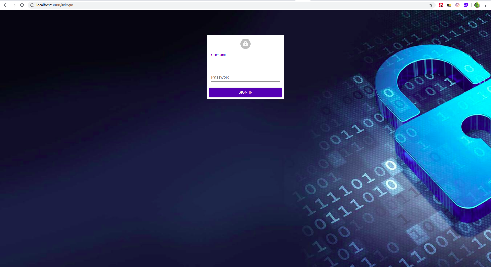
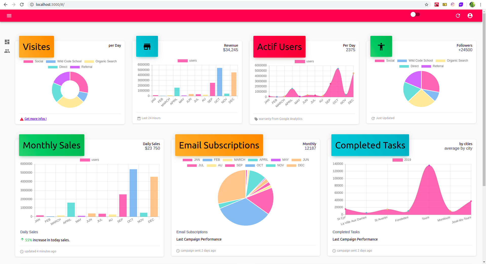
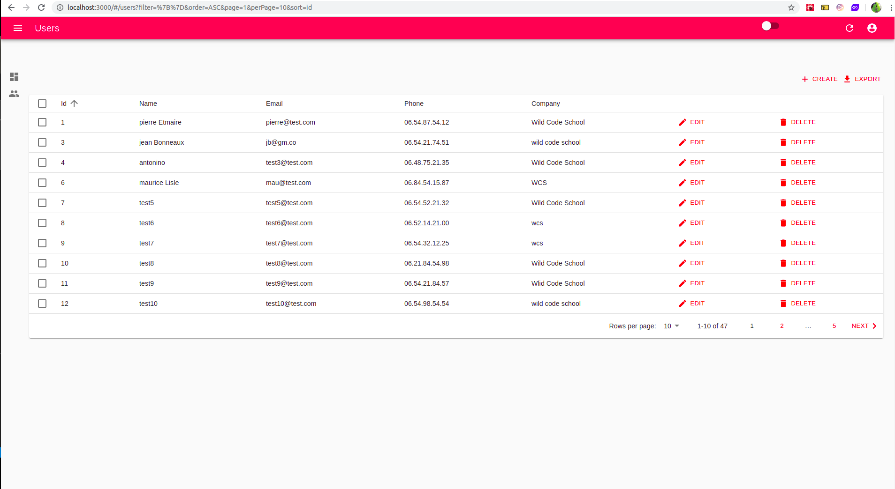
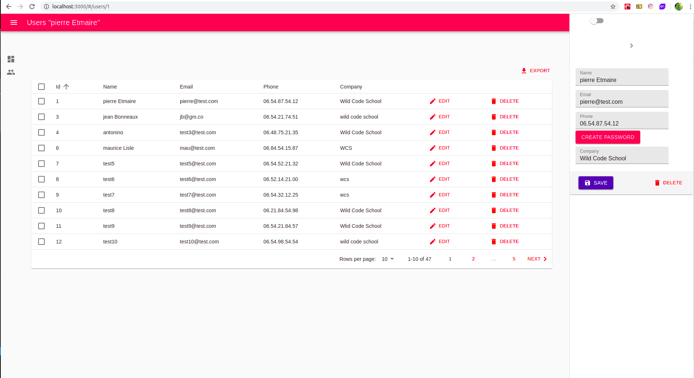
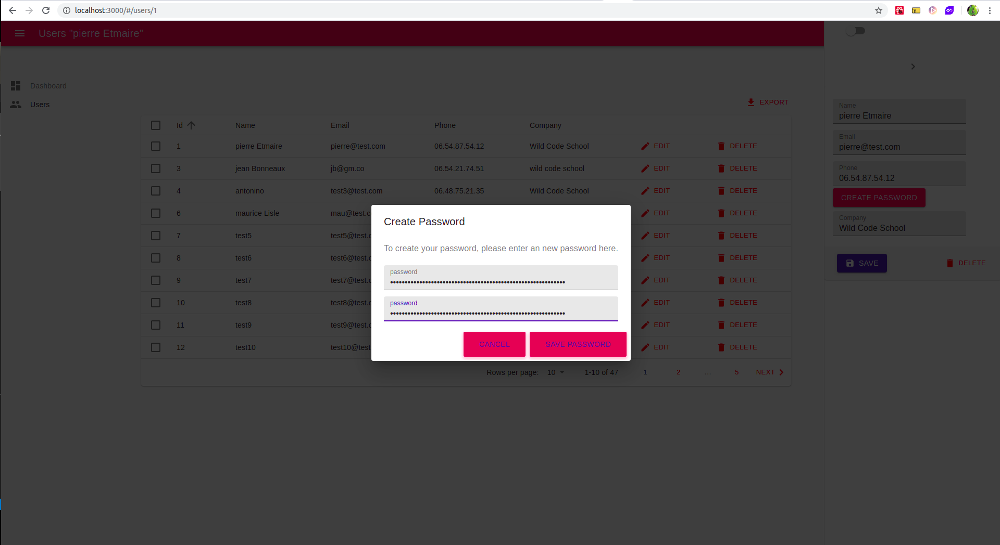
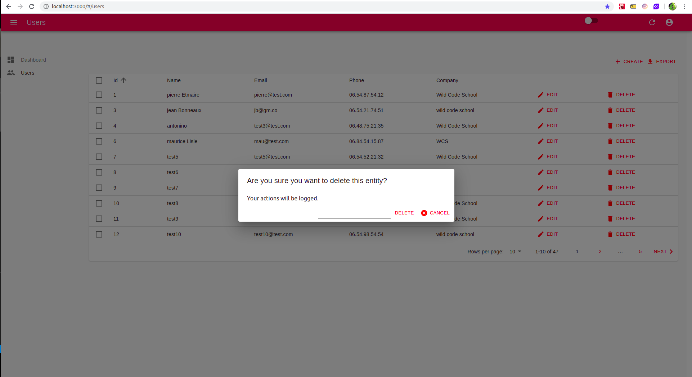

  #### Dark Mode
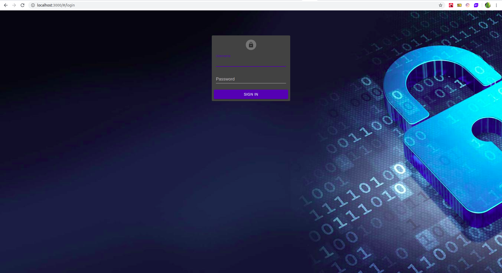
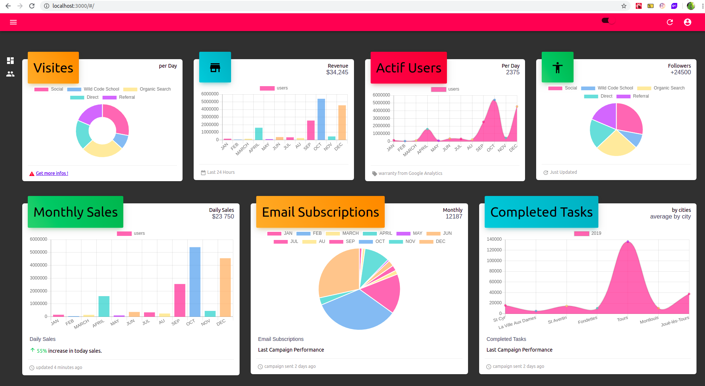
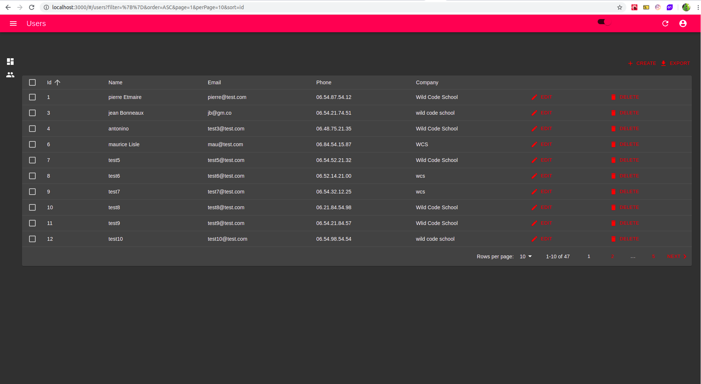
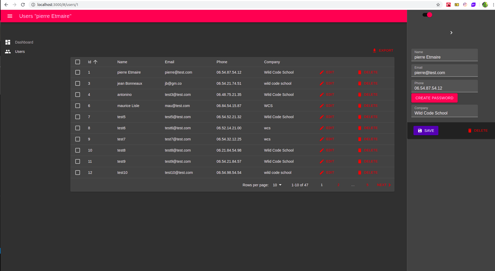
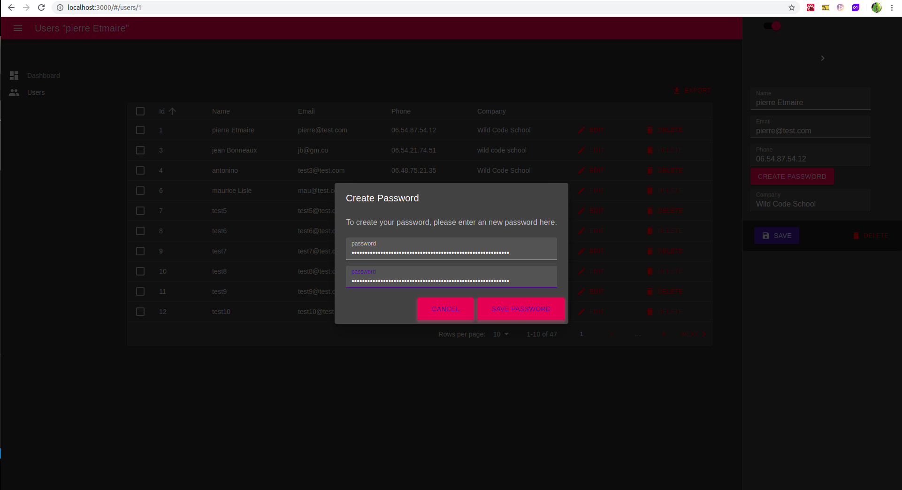
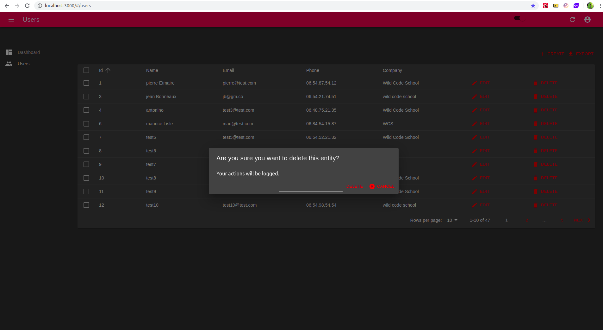

---

  

## Tech Stack
| Tech used | LINKS |
| ------ | ------ |
| React V-16.12.0 | [https://github.com/facebook/react] |
| React-Admin V-3.0.2 | [https://marmelab.com/react-admin/] |
| Material-ui V-4.7.1 | [https://material-ui.com/] |
| chart.js V-2.9.3 | [https://www.chartjs.org/] | 
| react-chartjs V-2 2.8.0 | [https://jerairrest.github.io/react-chartjs-2/] |
| classnames V-2.2.6 | [https://www.npmjs.com/package/classnames] |
| clsx V-1.0.4 | [https://www.npmjs.com/package/clsx] |
| react-redux V-7.1.3 | [https://redux.js.org/] |
| recompose V-0.30.0 | [https://github.com/acdlite/recompose] |
| validator V-12.1.0 | [https://www.npmjs.com/package/validator] |
| web-pack V-1.0.0 | [https://webpack.js.org/] |
---

### Dev Dependencies

- [eslint V6.6.0](https://eslint.org/)
		
		- "eslint-config-airbnb": "^18.0.1",
		- "eslint-plugin-import": "^2.18.2",
		- "eslint-plugin-jsx-a11y": "^6.2.3",
		- "eslint-plugin-react": "^7.17.0",
		- "eslint-plugin-react-hooks": "^1.7.0"

- Create-react-app with highly complex frontend structure

---  

### Full React admin Template

  


  

### Current components on this template


  

---

  

## Author

  

- Rodolphe Augusto - Dylan Belouis

  

---

  

## License

  

- MIT.

  

---

  

## Start project

- Clone this repo (https://github.com/WildCodeSchool/nfc-updates-front.git)

- Create ".env" file  on the root of your app and name it ".env.local" : 
- put in this file :
-  ``` REACT_APP_API_URL=http://localhost:5000  ```  => This is a backEnd localhost Url

- Make in the console :

-  ``` $ cd client```

-  ```  $ npm i``` or ``` $ npm install ```

for install the dependencies and

-  ``` $ npm start```

to start project.

  

enjoy!!!